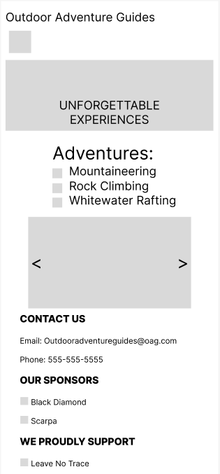
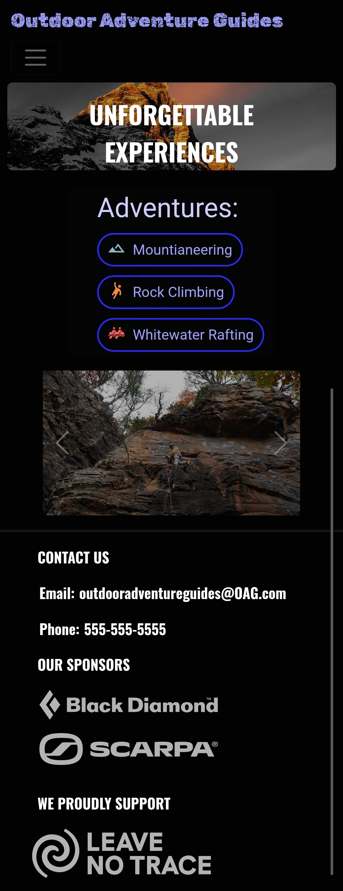
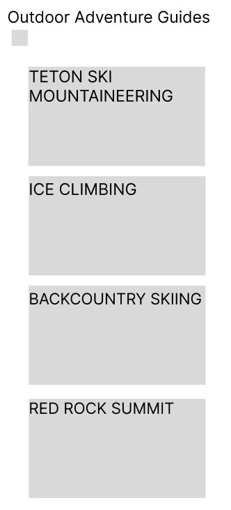
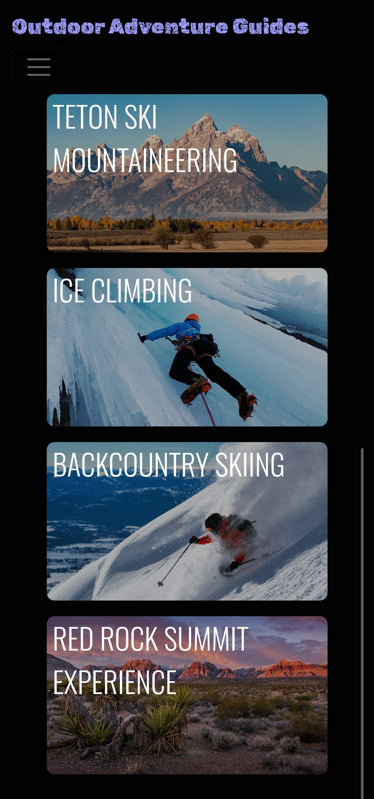

# Dylan Tompkins

## Project Overview: 
This is a website for an outdoor guide service company. The website scales to match screen size and keeps all images and texts properly displayed. This website provides information on the types of guide services and locations offered by the guide service. It allows the user to sumbit forms to the guide service that provide information about the user and the type of guide service, location, and date the user wants.

https://dktomp.github.io/Project1/

## Technologies used: 
- **html**
- **css**
- **boostrap**

## User Stories:
### User Story 
- **As a user, I want to browse guide services and locations, so that I can climb a route outdoors.**
### User Story 
- **As a user, I want to browse guide services and locations, so that I can go river rafting.**
### User Story 
- **As a user, I want to browse guide services and locations, so that I can go mountain climbing.**

## Wireframes:

 

## Ideas for future improvements:
- **Add calendar for user to select dates of services**
- **Add more images to make the page prettier**
- **Add accordians on specific adventure pages**